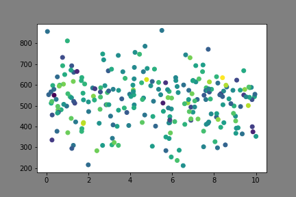
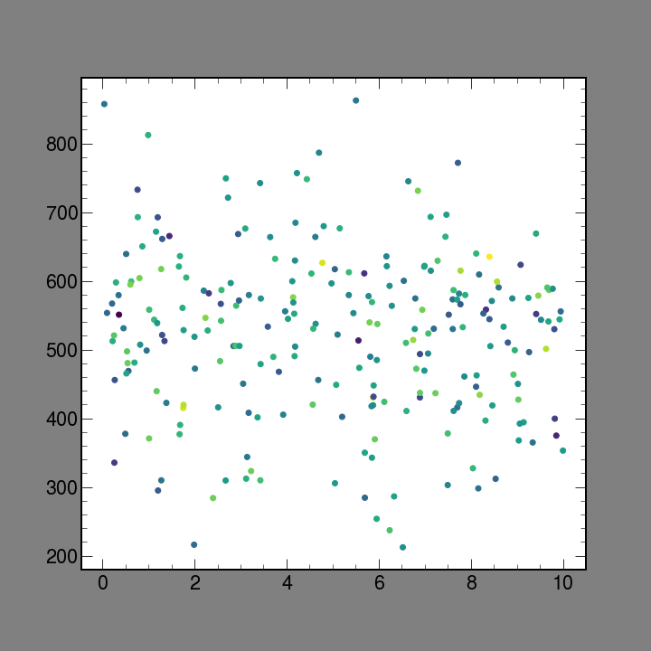
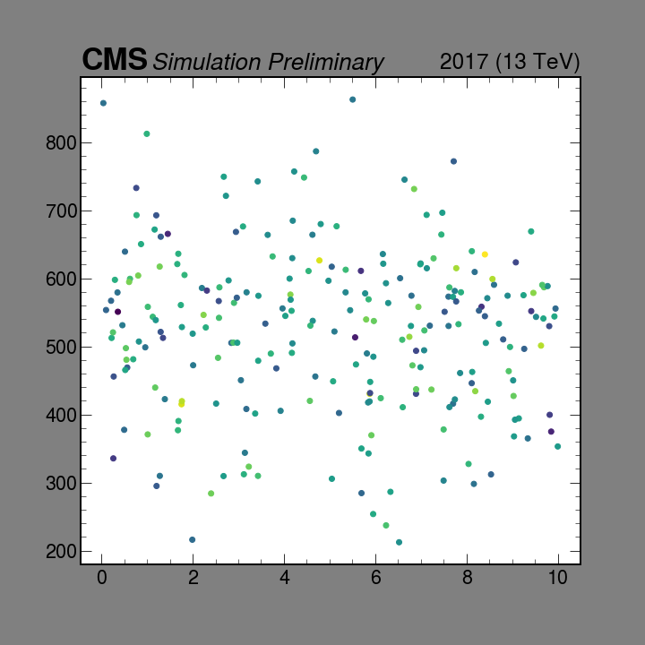

<p float="left">
  
</p>


A set of helpers for `matplotlib` to more easily produce plots typically
needed in HEP as well as style them in way that's compatible with current
collaboration requirements (ROOT).


# Installation
```
pip install mplhep
```
# Basic use

## Styling
```
import matplotlib.pyplot as plt
import mplhep as hep
plt.style.use(hep.style.ROOT)
```
Styles are also included in experiment specific helpers along with other styling
helper functions.
```
plt.style.use(hep.cms.style.ROOT)
plt.style.use(hep.atlas.style.ATLAS)
```
#### Minimal Example
```diff
import numpy as np
import matplotlib.pyplot as plt
+ import mplhep as hep

x = np.random.uniform(0, 10, 240)
y = np.random.normal(512, 112, 240)
z = np.random.normal(0.5, 0.1, 240)

+ plt.style.use(hep.style.ROOT)
f, ax = plt.subplots()
ax.scatter(x,y, c=z);

```

<p float="center">
  
  
</p>
*(gray padded to see figure size)

## Plotting
A pre-binned histogram plotter is provided, as this functionality is currently
awkward in `mpl`.

```diff
import numpy as np
import matplotlib.pyplot as plt
+ import mplhep as hep.plot as hplt

h, bins = np.histogram(np.random.normal(10,3,1000))

f, ax = plt.subplots()
- ax.step(bins, np.r_[h, h[-1]], step='post')
+ hplt.hplot(h, bins)

```
Additinal functionality is also wrapped inside.
- if `h` is a list of arrays or a 2d array, separate histograms will be plotted
- `stack=True` stack plots
- `yerr={None | True | array of ndim = h.ndim | array of ndim = h.ndim + 1}` is
available to plot `{ no | Poisson | one-sided | two-sided }` errors.
- `density=True` show density
- `weights`
- `histype={'step' | 'fill'}`
- `edges` when plotting with `'step'` close the shape outside

An effort has been made to provide API as close as possible to `plt.hist()`

# More Information

### Available styles:

- `plt.style.use(sty.ROOT)` - Default (figure 10x10 inches, full column size)
- `plt.style.use(sty.ROOTlegacy)` - Same as ROOT style above, but use ROOT fonts - Helvetica, fallback to Arial - instead of TeX Gyre Heros, requires font to be already available on the system
- `plt.style.use(sty.ROOTs)` - Default (figure 6x6 inches, half column size)
- `plt.style.use(sty.fira)` - use Fira Sans

- `plt.style.use(sty.firamath)` - use Fira Math

- `plt.style.use(sty.ATLAS)` - use default ATLAS style from https://github.com/kratsg/ATLASstylempl, note it defaults to Helvetica, which is not supplied in this package as explained below, and will only work properly if already available on the system

#### Styles can be chained:
- e.g. `plt.style.use([sty.ROOT, sty.fira, sty.firamath])`
- reappearing rcParams get overwritten silently

#### Styles can be modified on the fly
- Since styles are dictionaries and they can be chained/overwritten they can be easiely modified on the fly. e.g.
```
plt.style.use(sty.ROOT)
plt.style.use({"font.sans-serif":'Comic Sans MS'})
```

#### Styling with LaTeX
- `plt.style.use(sty.ROOTtex)` - Use LaTeX to produce all text labels
- Requires having the full tex-live distro
- True Helvetica
- Use sansmath as the math font
- Takes longer and not always better
- In general more possibilities, but a bit more difficult to get everything working properly

## Experiment annotations
```diff
+ plt.style.use(hep.cms.style.ROOT)
+ ax = hep.cms.cmslabel(ax, data=False, paper=False, year='2017')
```
<p float="center">
  
  
</p>


## Plot helper functions

#### Box (or other) aspect

#### Square plot with subplot (works with `tight_layout()`)

#### Append a new axes, without modifying the original

# Notes

## Consistency \& Fonts
As it is ROOT does not come with any fonts and therefore relies on using system fonts. Therfore the font in a figure can be dependent on whether it was produced on OSX or PC. The default sans-serif font used is Helvetica, but it only comes with OSX, in Windows this will silently fallback to Arial.

### License
Both Helvetica and Arial are proprietary, which as far as fonts go means you can use it to create any text/graphics once you have the license, but you cannot redistribute the font files as part of other software. That means we cannot just package Helvetica with this to make sure everyone has the same font in plots.

Luckily for fonts it seems only the software is copyrighted, not the actual shapes, which means there are quite a few open alternatives with similar look. The most closely resembling Helvetica being Tex Gyre Heros

#### Tex Gyre Heros
http://www.gust.org.pl/projects/e-foundry/tex-gyre/heros

You can compare yourself if the differences are meanigful below.

<p float="center">
  
</p>

They are Tex Gyre Heros, Helvetica and Arial respecively.

### Math Fonts
- Math fonts are a separate set from regular fonts due to the amount of special characters
- It's not trivial to make sure you get a matching math font to your regular font
- Most math-fonts are serif fonts, but this is not ideal if one wants to use sans-serif font for normal text like Helvetica or Arial
- The number of sans-serif math-fonts is very limited
 	- The number of **open** sans-serif math-fonts is **extremely** limited
 	- Basically there's two, Fira Sans and GFS Neohellenic Math, of which I like Fira Sans better
 	- https://tex.stackexchange.com/questions/374250/are-there-opentype-sans-math-fonts-under-development

For consistent styling Fira Sans is included as well.
#### Default Fira Sans
https://github.com/mozilla/Fira
#### Math font extension
https://github.com/firamath/firamath

## What doesn't work

### Context styles and fonts
```
with pyplot.style.context(sty.ROOT):
    plotting...
```
- This syntax would be ideal, however, it doesn't work properly for fonts and there are no plans by mpl devs to fix this behaviour https://github.com/matplotlib/matplotlib/issues/11673

For now one has to set the style globally
```
plt.style.use(sty.ROOT)
```
