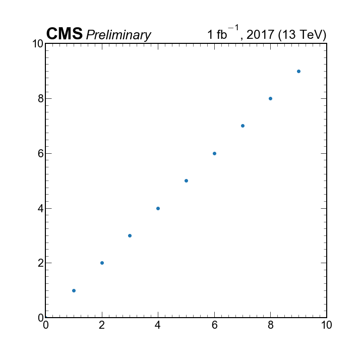

# cmsstyle
- offering mpl stylesheets to modify the defaults to look ROOT-like
- A set of helper functions for common labeling
- Works by copying styles and fonts to respective matplotlib data locations

# Installation 
```
pip install cmsstyle
```
Installation places optimized style sheets to your matplotlib `stylelib` folder and Firs Sans and Fira Math fonts into your `mpl-data` folder .

# Use
- `plt.style.use(['ROOT'])`
- For examples see https://github.com/andrzejnovak/cmsstyle/blob/master/Examples.ipynb

<p float="center">
  
   
</p>

### Available styles:

- `plt.style.use(['ROOT'])` - Default (figure 10x10 inches, full column size)
- `plt.style.use(['ROOTs'])` - Default (figure 6x6 inches, half column size)
- `plt.style.use(['fira'])` - use Fira Sans (open typeface)
- `plt.style.use(['firamath'])` - use Fira Math (open typeface)

## Consistency \& Fonts
As it is ROOT uses system fonts and thus the font in a figure can be dependent on whether it was produced on OSX or PC (former serves Helvetica and latter Arial, which are similar but not the same).

For consistency a default sans-serif font - **Fira Sans** is served with this package (for now experimentally). 
#### Default Fira Sans
https://github.com/mozilla/Fira
#### Math font extension
https://github.com/firamath/firamath