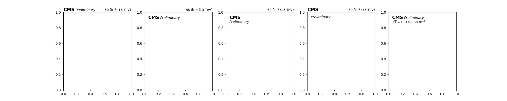

<p float="left">
  
</p>

[](https://zenodo.org/badge/latestdoi/184555939)
[![Scikit-HEP][sk-badge]](https://scikit-hep.org/)

[sk-badge]: https://scikit-hep.org/assets/images/Scikit--HEP-Project-blue.svg

[](https://mplhep.readthedocs.io/en/latest/?badge=latest)
[](https://badge.fury.io/py/mplhep)
[](https://anaconda.org/conda-forge/mplhep)
[](https://pypi.org/project/mplhep/)

[](https://travis-ci.org/scikit-hep/mplhep)
[](https://github.com/scikit-hep/mplhep/actions?query=workflow%3ACI%2FCD+branch%3Amaster)
[](https://github.com/scikit-hep/mplhep/actions?query=workflow%3A%22publish+distributions%22+branch%3Amaster)
[](https://results.pre-commit.ci/latest/github/scikit-hep/mplhep/master)

[](https://img.shields.io/pypi/dw/mplhep?label=downloads%20%28incl%20CI%29)

[](https://mybinder.org/v2/gh/scikit-hep/mplhep/master)

A set of helpers for `matplotlib` to more easily produce plots typically
needed in HEP as well as style them in way that's compatible with current
collaboration requirements (ROOT-like plots for CMS, ATLAS, LHCb, ALICE).


# Installation

```bash
pip install mplhep
```

# Getting Started
A tutorial given at PyHEP 2020 is available as a binder [here](https://github.com/andrzejnovak/2020-07-17-pyhep2020-mplhep)
or you can watch the recording [here](https://www.youtube.com/watch?v=gUziXqCGe0o).

Documentation can be found at [mplhep.readthedocs.io](https://mplhep.readthedocs.io).

### Styling

```python
import mplhep as hep
hep.style.use(hep.style.ROOT) # For now ROOT defaults to CMS
# Or choose one of the experiment styles
hep.style.use(hep.style.ATLAS)
# or
hep.style.use("CMS") # string aliases work too
# {"ALICE" | "ATLAS" | "CMS" | "LHCb1" | "LHCb2"}
```

Or use `matplotlib` API directly

```python
plt.style.use(hep.style.ROOT)
```
**If the default styles are not what you need, please open an issue.**

Default experiment labels are also available.

```python
# Overall - both left and right annotation
hep.<experiment>.label(<text>, data=<True|False>, lumi=50, year=2017)
# Just experiment label and <text> such as 'Preliminary' or 'Simulation'
hep.<experiment>.text(<text>)
```

You can use `loc={0..5}` to control the label positioning.

<p float="left">
  
</p>


### Plotting
#### 1D Histograms

```python
h, bins = [2, 3, 2], [0, 1, 2, 3]
hep.histplot(h, bins)
```

#### 2D Histograms

```python
import numpy as np
xbins, ybins = [0, 1, 2, 3], [0, 1, 2, 3]
H = np.array([[2,3,2], [1,2,1], [3,1,3]])
hep.hist2dplot(H, xbins, ybins)
```

# More Information

### Save all labels at once
- `hep.savelabels('test.png')` will produces 4 variation on experiment label
  - "" -> "test.png"
  - "Preliminary" -> "test_pas.png"
  - "Supplementary" -> "test_supp.png"
  - "Work in Progress" -> "test_wip.png"
- Options can also be specified manually
  - `hep.savelabels('test', labels=["FOO", "BAR"], suffixes=["foo.pdf", "bar"])` will produce
    - "FOO" -> "foo.pdf"
    - "BAR" -> "test_bar.png"
- Other components of `<experiment>.label()` will remain unchanged.

### Other styles:
- `hep.style.use("fira")` - use Fira Sans
- `hep.style.use("firamath")` - use Fira Math

#### Styles can be chained:
- e.g. `hep.style.use(["CMS", "fira", "firamath"])`
- reappearing `rcParams` get overwritten silently

#### Styles can be modified on the fly
- Since styles are dictionaries and they can be chained/overwritten they can be easily modified on the fly. e.g.
```
hep.style.use("CMS")
hep.style.use({"font.sans-serif":'Comic Sans MS'})
```

#### Styling with LaTeX
- `hep.style.use("CMSTex")` - Use LaTeX to produce all text labels
- Requires having the full tex-live distro
- True Helvetica
- Use sansmath as the math font
- Takes longer and not always better
- In general more possibilities, but a bit more difficult to get everything working properly

# Notes

## Consistency \& Fonts
As it is ROOT does not come with any fonts and therefore relies on using system fonts. Therfore the font in a figure can be dependent on whether it was produced on OSX or PC. The default sans-serif font used is Helvetica, but it only comes with OSX, in Windows this will silently fallback to Arial.

### License
Both Helvetica and Arial are proprietary, which as far as fonts go means you can use it to create any text/graphics once you have the license, but you cannot redistribute the font files as part of other software. That means we cannot just package Helvetica with this to make sure everyone has the same font in plots.

Luckily for fonts it seems only the software is copyrighted, not the actual shapes, which means there are quite a few open alternatives with similar look. The most closely resembling Helvetica being Tex Gyre Heros

#### Tex Gyre Heros
http://www.gust.org.pl/projects/e-foundry/tex-gyre/heros

You can compare yourself if the differences are meanigful below.

<p float="center">
  
</p>

They are Tex Gyre Heros, Helvetica and Arial respecively.

### Math Fonts
- Math fonts are a separate set from regular fonts due to the amount of special characters
- It's not trivial to make sure you get a matching math font to your regular font
- Most math-fonts are serif fonts, but this is not ideal if one wants to use sans-serif font for normal text like Helvetica or Arial
- The number of sans-serif math-fonts is very limited
 	- The number of **open** sans-serif math-fonts is **extremely** limited
 	- Basically there's two, Fira Sans and GFS Neohellenic Math, of which I like Fira Sans better
 	- https://tex.stackexchange.com/questions/374250/are-there-opentype-sans-math-fonts-under-development

For consistent styling Fira Sans is included as well.
#### Default Fira Sans
https://github.com/mozilla/Fira
#### Math font extension
https://github.com/firamath/firamath

## What doesn't work

### Context styles and fonts

```python
with pyplot.style.context(style.ROOT):
    plotting...
```
- This syntax would be ideal, however, it doesn't work properly for fonts and there are no plans by mpl devs to fix this behaviour https://github.com/matplotlib/matplotlib/issues/11673

For now one has to set the style globally:

### Use in publications

Updating list of citations and use cases of `mplhep` in publications:

- [Simultaneous Jet Energy and Mass Calibrations with Neural Networks](https://cds.cern.ch/record/2706189), ATLAS Collaboration, 2019
- [Integration and Performance of New Technologies in the CMS Simulation](https://arxiv.org/abs/2004.02327), Kevin Pedro, 2020 (Fig 5,6)
- [GeantV: Results from the prototype of concurrent vector particle transport simulation in HEP](https://arxiv.org/abs/2005.00949), Amadio et al, 2020 (Fig 25,26)
- [Search for the standard model Higgs boson decaying to charm quarks](https://cds.cern.ch/record/2682638), CMS Collaboration, 2019 (Fig 1)
- [Search for long-lived particles decaying to eμν](https://arxiv.org/abs/2012.02696), LHCb Collaboration, 2020
